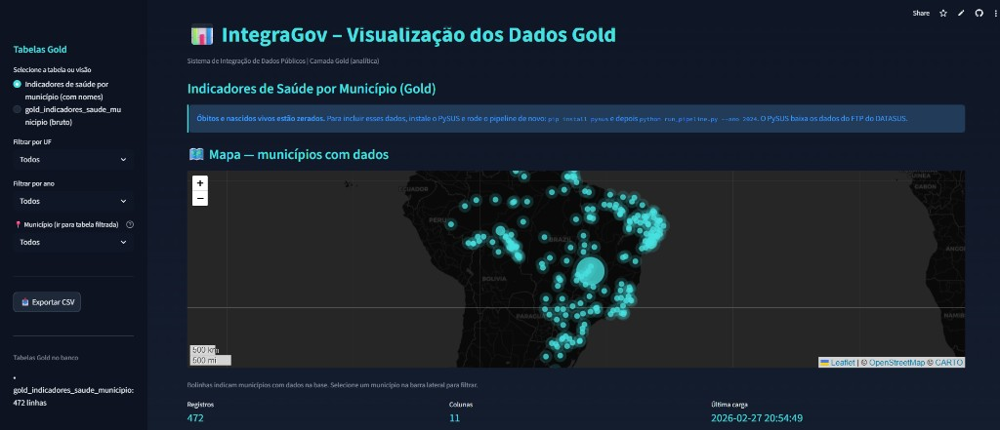

# IntegraGov – Integração de Dados Públicos Brasileiros

Sistema de integração, cruzamento e análise de bases de dados públicas do Brasil, com foco em políticas públicas e gestão governamental. Arquitetura **Data Lakehouse** (Bronze → Silver → Gold), execução local e interface web com mapa e tabelas.

### Aplicação online

**[Acesse a aplicação IntegraGov](https://integragov.streamlit.app/)**

[](https://integragov.streamlit.app/)

## Objetivo

Centralizar dados de **IBGE** e **saúde (DATASUS)**, padronizar pelo código de município (7 dígitos IBGE) e disponibilizar indicadores para análise e dashboards.

## Tecnologias

- **Python 3.10+** · **Pandas** · **SQLite** (MVP) · **Streamlit** · **Folium**
- Fontes: **API IBGE** (localidades, população) e **PySUS** (FTP DATASUS: SIM, Sinasc)

## Arquitetura (Data Lakehouse)

| Camada   | Uso local                    | Descrição |
|----------|------------------------------|-----------|
| **Bronze** | `data/bronze/` (parquet/csv) | Dados brutos das fontes, imutáveis |
| **Silver** | `data/silver/` + SQLite      | Dados tratados, código município 7 dígitos |
| **Gold**   | `data/gold/` + SQLite        | Indicadores agregados (ex.: taxas por 100 mil hab.) |

Banco local: `data/integragov.db` (SQLite). Preparado para migração para PostgreSQL.

## Fontes de dados utilizadas

- **IBGE (API oficial)**  
  - [Localidades](https://servicodados.ibge.gov.br/api/docs/localidades): lista de municípios (código, nome, UF).  
  - [Agregados SIDRA](https://servicodados.ibge.gov.br/api/docs/agregados) (tabela 6579): população residente estimada por município/ano.

- **DATASUS (via PySUS)**  
  - **SIM** (óbitos) e **Sinasc** (nascidos vivos) via biblioteca [PySUS](https://pysus.readthedocs.io/), que consome o FTP oficial do DATASUS.  
  - As APIs REST do Ministério da Saúde (DEMAS) estão fora do ar (404); por isso o projeto usa apenas PySUS para saúde.

- **Centroides (mapa)**  
  - [Municipios-Brasileiros](https://github.com/kelvins/Municipios-Brasileiros) (CSV): latitude/longitude por código IBGE para exibir o mapa.

## Pré-requisitos

- Python 3.10 ou superior  
- Conexão com internet (APIs e download de centroides)

## Instalação e uso

### 1. Clone e ambiente

```bash
git clone https://github.com/SEU_USUARIO/IntegraGov.git
cd IntegraGov
python -m venv .venv
.venv\Scripts\activate   # Windows
# source .venv/bin/activate   # Linux/macOS
pip install -r requirements.txt
```

### 2. Pipeline (coleta e processamento)

```bash
# Amostra padrão: 100 municípios (rápido)
python run_pipeline.py --ano 2024

# Amostra customizada (ex.: 200 municípios)
python run_pipeline.py --ano 2024 --amostra 200

# Todos os municípios (mais lento)
python run_pipeline.py --ano 2024 --todos-municipios
```

**Dados de saúde (óbitos e nascidos vivos):** instale o PySUS para incluir SIM e Sinasc:

```bash
pip install pysus
python run_pipeline.py --ano 2024
```

O download via PySUS pode demorar (arquivos por UF/ano).

### 3. Interface web

```bash
streamlit run app.py
```

Abre no navegador: tabelas Gold, **mapa do Brasil** (bolinhas por município com dados), filtros por **UF**, **ano** e **Município**, e exportação em CSV. É necessário ter rodado o pipeline antes (`data/integragov.db` deve existir).

## Estrutura do projeto

```
IntegraGov/
├── config/           # Configurações (caminhos, URLs)
├── data/             # Bronze, Silver, Gold e SQLite (gerados pelo pipeline)
├── src/
│   ├── connectors/   # IBGE, DATASUS (PySUS), fallback PySUS
│   └── transform/   # Silver, Gold
├── run_pipeline.py   # Orquestração do pipeline
├── app.py            # Interface Streamlit
├── requirements.txt
├── LICENSE
└── README.md
```

## Roadmap

| Fase | Escopo |
|------|--------|
| **1 (atual)** | MVP Saúde e Demografia: IBGE (municípios, população) + PySUS (SIM, Sinasc). |
| **2** | Educação: INEP (Censo Escolar, IDEB). |
| **3** | Transparência: Portal da Transparência (gastos, convênios). |
| **Hospedagem** | PostgreSQL, orquestração (Airflow/Prefect), BI (Metabase/Superset). |

## Variáveis de ambiente (opcional)

- `INTEGRAGOV_FASE=1` – Fase do MVP (1, 2 ou 3).  
- `INTEGRAGOV_DEBUG=1` – Logs mais verbosos.  
- `LOG_LEVEL=DEBUG` – Nível de log.

## Licença

Este projeto está sob a licença **MIT**. Ver [LICENSE](LICENSE).  
Os dados utilizados são de fontes públicas (IBGE, DATASUS); o uso dos dados deve respeitar as políticas de cada órgão.
