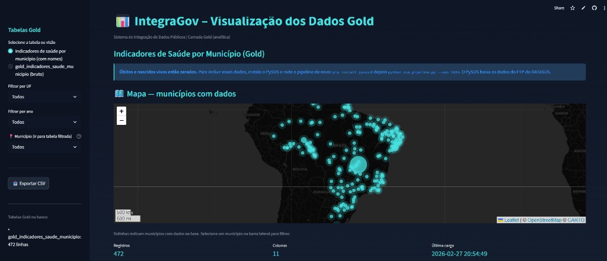

# IntegraGov – Integração de Dados Públicos Brasileiros

Sistema de integração, cruzamento e análise de bases de dados públicas do Brasil, com foco em políticas públicas e gestão governamental. Arquitetura **Data Lakehouse** (Bronze → Silver → Gold), execução local e interface web com abas temáticas, gráficos interativos e mapa.

### Aplicação online

**[Acesse a aplicação IntegraGov](https://integragov.streamlit.app/)**

[](https://integragov.streamlit.app/)

---

## Objetivo

Centralizar dados de múltiplas APIs governamentais abertas do Brasil, padronizados pelo código de município IBGE (7 dígitos), e disponibilizá-los em um dashboard analítico.

## Bases integradas

| # | Base | Fonte | Autenticação |
|---|------|--------|-------------|
| 1 | **Municípios** | IBGE Localidades | Nenhuma |
| 2 | **População** | IBGE SIDRA (tabela 6579) | Nenhuma |
| 3 | **PIB Municipal** | IBGE SIDRA (tabela 5938) | Nenhuma |
| 4 | **Óbitos** | DATASUS SIM (via PySUS) | Nenhuma |
| 5 | **Nascidos vivos** | DATASUS Sinasc (via PySUS) | Nenhuma |
| 6 | **Censo Escolar** | INEP (Sinopse / microdados) | Nenhuma |
| 7 | **Transferências federais** | Portal da Transparência | Chave gratuita |
| 8 | **Centroides (mapa)** | Municipios-Brasileiros (GitHub) | Nenhuma |

## Tecnologias

- **Python 3.10+** · **Pandas** · **SQLite** (MVP) · **Streamlit** · **Plotly** · **Folium** · **openpyxl**
- Todas as APIs são públicas e abertas — nenhuma requer cadastro, exceto o Portal da Transparência (chave gratuita)

## Arquitetura (Data Lakehouse)

```
APIs Públicas (IBGE · DATASUS · INEP · Transparência)
        │
        ▼
   BRONZE  data/bronze/         ← dados brutos (parquet + csv), imutáveis
        │
        ▼
   SILVER  data/silver/ + SQLite ← padronização (código município 7 dígitos)
        │
        ▼
   GOLD    data/gold/  + SQLite  ← indicadores agregados (taxas, rankings)
        │
        ▼
   Streamlit Dashboard (app.py)
```

Banco local: `data/integragov.db` (SQLite). Preparado para migração para PostgreSQL.

## Dashboard — Abas

| Aba | Conteúdo |
|-----|---------|
| 📊 **Visão Geral** | KPIs consolidados, Top 10 por população, distribuição por UF, resumo por tema |
| 🏥 **Saúde** | Taxa de óbitos, nascidos vivos, scatter população × óbitos |
| 📚 **Educação** | Matrículas, docentes, escolas, taxa por 1.000 hab. |
| 💰 **PIB Municipal** | PIB total e per capita por município (IBGE SIDRA 5938) |
| 🗺️ **Mapa** | Mapa interativo por camada (saúde / educação / PIB) |
| 📋 **Dados brutos** | Explorador de todas as tabelas com exportação CSV |

## Instalação

```bash
git clone https://github.com/SEU_USUARIO/IntegraGov.git
cd IntegraGov
python -m venv .venv
.venv\Scripts\activate      # Windows
# source .venv/bin/activate  # Linux/macOS
pip install -r requirements.txt
```

## Pipeline de dados

```bash
# Básico: saúde + educação (amostra de 100 municípios)
python run_pipeline.py --ano 2024

# Amostra maior
python run_pipeline.py --ano 2024 --amostra 500

# Todos os municípios (5.570 — pode demorar)
python run_pipeline.py --ano 2024 --todos-municipios

# Incluir PIB municipal (IBGE SIDRA 5938 — dados até ~2021)
python run_pipeline.py --ano 2024 --incluir-pib

# Incluir transferências federais (Portal da Transparência)
export TRANSPARENCIA_API_KEY=<sua-chave>   # obtenha grátis em portaldatransparencia.gov.br
python run_pipeline.py --ano 2024 --incluir-transparencia
```

**Dados de saúde (SIM/Sinasc):** instale o PySUS separadamente:

```bash
pip install pysus
python run_pipeline.py --ano 2024
```

## Interface web

```bash
streamlit run app.py
```

Abre em `http://localhost:8501`. É necessário ter rodado o pipeline antes (`data/integragov.db` deve existir).

## Estrutura do projeto

```
IntegraGov/
├── config/
│   └── settings.py          # URLs, caminhos, constantes
├── data/
│   ├── bronze/              # Dados brutos por fonte
│   ├── silver/              # Dados padronizados
│   ├── gold/                # Indicadores agregados
│   └── integragov.db        # SQLite (gerado pelo pipeline)
├── src/
│   ├── connectors/
│   │   ├── ibge.py          # IBGE: municípios, população, PIB (SIDRA)
│   │   ├── datasus.py       # DATASUS: SIM, Sinasc (via PySUS)
│   │   ├── inep.py          # INEP: Censo Escolar
│   │   └── transparencia.py # Portal da Transparência (transferências)
│   ├── transform/
│   │   ├── silver.py        # Padronização e limpeza
│   │   └── gold.py          # Agregações e indicadores
│   └── db.py                # Schema SQLite
├── run_pipeline.py          # Orquestrador
├── app.py                   # Dashboard Streamlit
└── requirements.txt
```

## Variáveis de ambiente

| Variável | Padrão | Descrição |
|----------|--------|-----------|
| `TRANSPARENCIA_API_KEY` | — | Chave da API do Portal da Transparência (gratuita) |
| `INTEGRAGOV_DEBUG` | `0` | Logs detalhados (`1` para ativar) |
| `LOG_LEVEL` | `INFO` | Nível de log Python |

## Roadmap

| Fase | Status | Escopo |
|------|--------|--------|
| **1** | ✅ Concluído | Saúde (DATASUS/PySUS), Demografia (IBGE), Educação (INEP) |
| **2** | ✅ Concluído | PIB Municipal (IBGE SIDRA 5938), Portal da Transparência |
| **3** | 🔄 Planejado | IDEB (INEP), CNES (estabelecimentos de saúde), SNIS (saneamento) |
| **Infra** | 🔄 Planejado | PostgreSQL, Airflow/Prefect, Metabase/Superset |

## Licença

MIT. Ver [LICENSE](LICENSE).
Os dados utilizados são de fontes públicas abertas (IBGE, DATASUS, INEP, Portal da Transparência). O uso dos dados deve respeitar as políticas de cada órgão.
